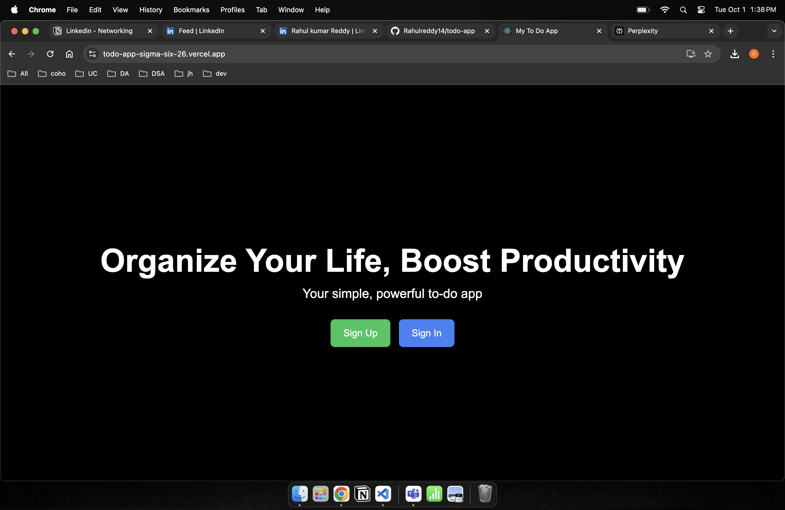
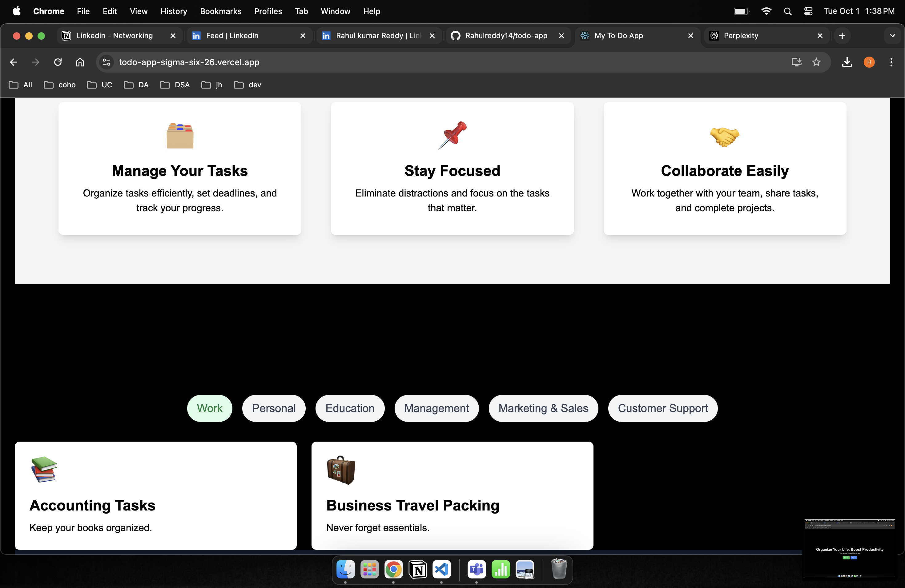
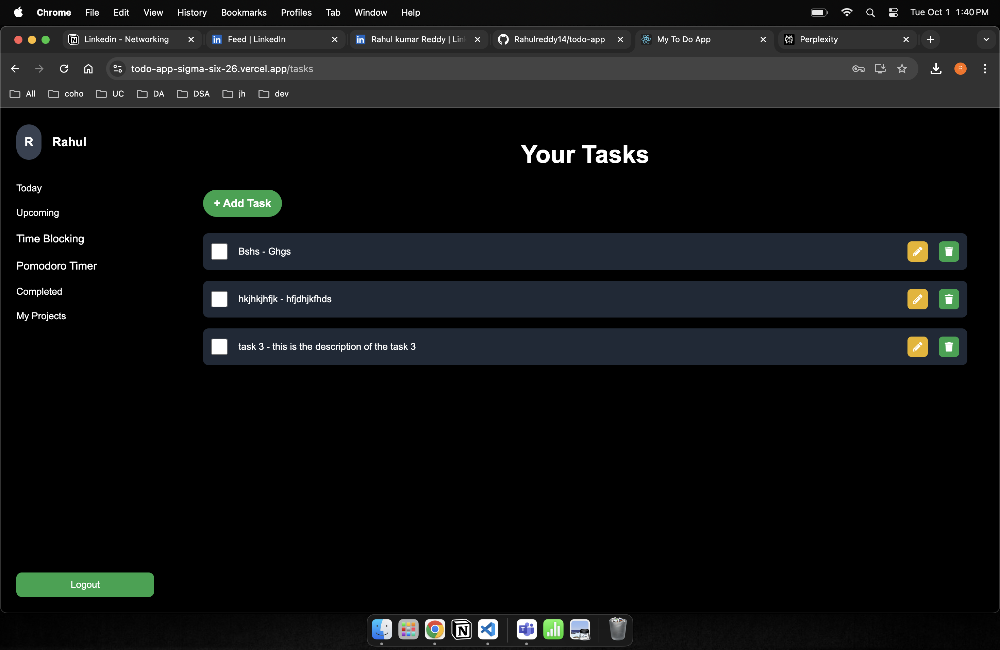
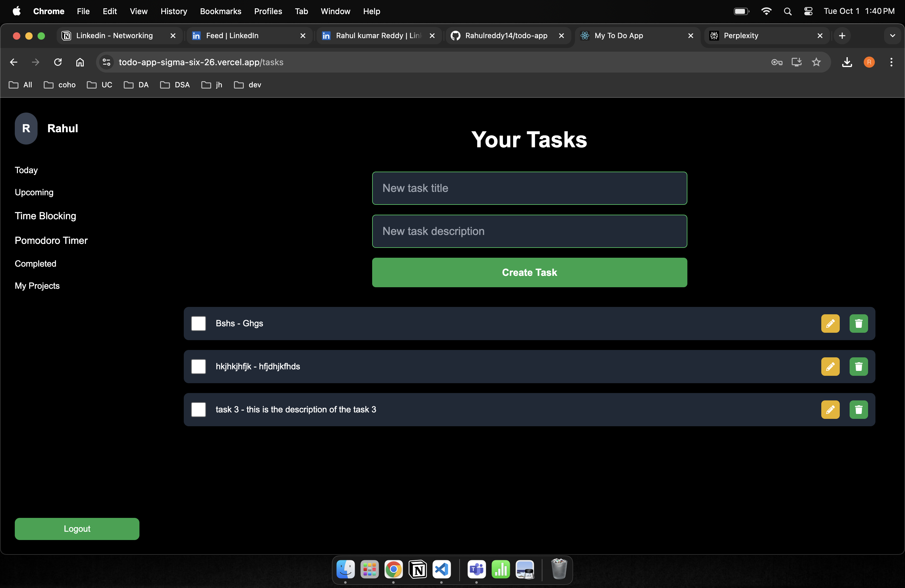

# 🚀Task Management Application 🎯

Welcome to the **MERN Stack To-Do Application** — your ultimate productivity partner! This app helps you manage your daily tasks with ease, offering a sleek, minimal UI and a robust backend for task management. Built with the MERN stack (MongoDB, Express, React, Node.js), this app is fully authenticated using JWT, ensuring your tasks are safe and secure.

## 💡 Key Features
- **🔐 User Authentication with JWT**: Secure sign-up and login functionality.
- **📝 Task Management**: Create, edit, and delete tasks.
- **📋 Real-Time Task Status**: Mark tasks as completed or pending with visual indicators.
- **🎨 Beautiful UI**: Designed with **Tailwind CSS** for a sleek and minimal interface.
- **⚡ Fully Functional Backend**: API-driven backend using Node.js and Express.
- **🔄 State Management**: Built using Redux for seamless task updates.

## 🛠️ Tech Stack
- **Frontend**: React, Tailwind CSS
- **Backend**: Node.js, Express
- **Database**: MongoDB
- **Authentication**: JWT (JSON Web Token)
- **State Management**: Redux Toolkit
- **Version Control**: GitHub
- **Deployment**: Vercel

## 🚀 How to Install and Run Locally

Follow these steps to get the app running on your local machine.

🔥 Features to be Added (Future Updates)
⏳ Pomodoro Technique Integration: Incorporate a Pomodoro Timer for enhanced time management, helping users stay productive by working in focused intervals.
📊 Analytics Dashboard: Visualize task completion rates, daily productivity stats, and more.
🗣️ Real-Time Collaboration: Share tasks with team members or friends in real time.
🔔 Push Notifications: Get notified for upcoming deadlines or tasks.
🎨 Themes and Customization: Add light/dark mode toggles and custom themes for a personalized experience.
📱 Mobile Responsiveness: Enhance UI for mobile, making task management seamless on any device.

🌐 Live Demo

https://todo-app-sigma-six-26.vercel.app/

### 🏠 Landing Page

### 🔐 Sign in Page: Using JWT

### 👤 Sign up Page

### 🏡 Home Page

## Features I am working on

- 🚀 Time Blocking page
- 🔒 Pomodoro Technique
- 📱 Mobile responsiveness - Existing with some extent
- 🔍 Advanced search functionality
- 🌐 Multi-language support

🧑‍💻 Contributing
We welcome contributions! 🎉 Feel free to fork the repo and submit a pull request for new features, bug fixes, or improvements.

Fork the project
Create a new feature branch (git checkout -b feature/new-feature)
Commit your changes (git commit -m 'Added a new feature')
Push to the branch (git push origin feature/new-feature)
Open a Pull Request
⚖️ License
This project is licensed under the MIT License - see the LICENSE file for details.
